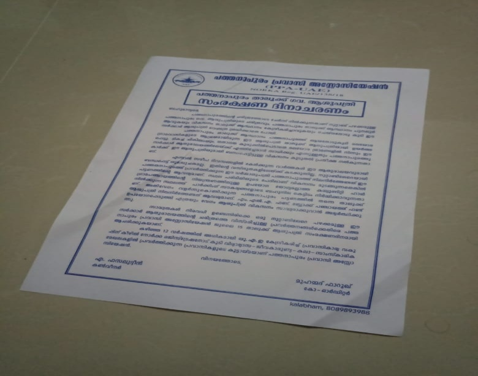
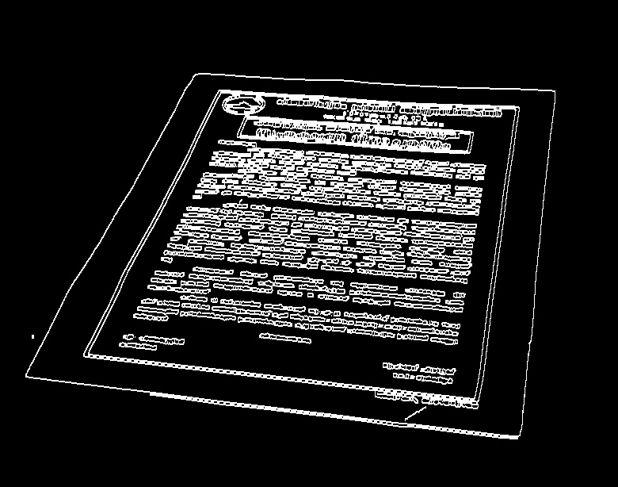
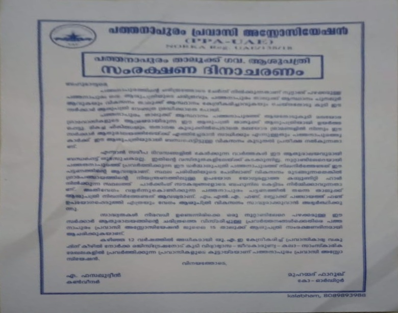
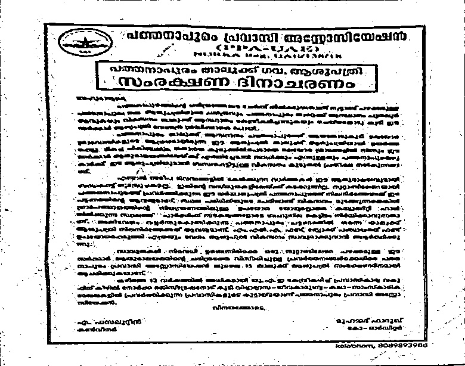

# Document Scanner

I will detail the steps involved in this project, so that the reader may get a general understanding of the project flow.

### Load Images :
This is the obvious first step. I have choosen the picture of a notice that was lying around.

### Performing preprocessing operations :
To improve the speed and effectiveness of the program, we first convert the image to grayscale.Then we perform the edge detection ,dilation and erosion applications to get a binary image consisting of the detected edges.

###  Performing contour detection :
We use the binary image to obtain the list of  contours in the image. We sort the list to get the largest contour points.

### Applying warp perspective :
The warp perspective function is sesitive to the location of the points hence we reorder the contour points in the clockwise order.
<<<<<<< HEAD
finally we get our output as

### Applying threshold :
To give the output a fresh scanner BnW feel we do a quick adaptive threshold of the output image to get the final output.
=======
finally we get our output 
>>>>>>> 6a5887e9985d87ae5d79a77b2a7cdda77298e94e

**Note**  :This is just a simplified explanation of the many processes in the program. To Learn the various methodologies and explore alternate methods please check the websites below 

 - [PyImage Search](https://www.pyimagesearch.com/)
 -  [Murtaza Hassan](https://www.murtazahassan.com/)

If you liked the project , do leave a :star:
